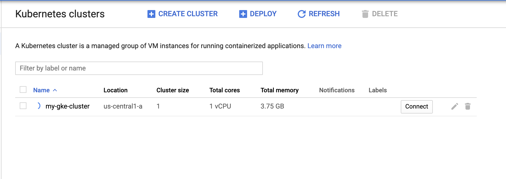

# GKE terraform cluster management

This repo contains easy setup for Kubernetes cluster in GKE using terraform.
Allows you to manage and maintain the state of multiple clusters.

## Requirements

You need to make sure you have terraform and google cloud console installed.

```sh
# Install terraform
brew install terraform

# Install and setup gcloud cli as well
brew install gcloud

# Initialize and setup gcloud towards your google cloud account
gcloud init
```

## Deployment Prerequisites

If you have a google account and project setup you can skip this section. Otherwise you need
to make sure the setup is done.

1. Sign up for a new [Google Cloud Platform](https://cloud.google.com) account or if you have one you should be good.
1. Follow the instructions on Google's [Kubernetes Engine Quickstart](https://cloud.google.com/kubernetes-engine/docs/quickstart) page to create or select a project in your account, enable the Google Kubernetes Engine API in your project, and enable billing for your project. 
1. Follow these [instructions](https://www.terraform.io/docs/providers/google/index.html#authentication-json-file) to download an authentication JSON file for your project which Terraform will use when provisioning resources to your GCP project.

## Setup

To run the terraform scripts you need to make sure the environment variable for your credentials is
set. Head over to google cloud and create a service account https://cloud.google.com/iam/docs/creating-managing-service-accounts.

The service account needs access to Cloud Storage, Kuberentes, and Compute.

```sh
# Specify the location of your service account file
export GOOGLE_CREDENTIALS=../config/account.json
```

The config variables are available in config/cluster.tfvars and can be updated in there.
So if you would like to increate the node size e.t.c you can change variables in that file. 

## Deployment

These are the steps to deploy your cluster to GKE. 

1. Fork the repository on your local machine.
1. Set variables in config/cluster.tfvars like gcp_project, gcp_zone e.t.c. to use. The variable descriptions are in variables.tf file.

```sh
# Run terraform init to setup state file
terraform init

# Run terraform plan to checkout changes that will be applied
terraform plan -var-file config/cluster.tfvars

# Apply terraform to start creating the infrastructure
terraform apply -var-file config/cluster.tfvars
```

Terraform apply will create your cluster in GKE as specified.

You will see outputs representing the URLs to access your GKE cluster in the Google Console, the FQDN of your cluster, e.t.c. 

You can also validate that the cluster was created in the Google Console.



## Destroy or clean up 

```sh
# Take down the cluster
terraform destroy -var-file config/cluster.tfvars
```
